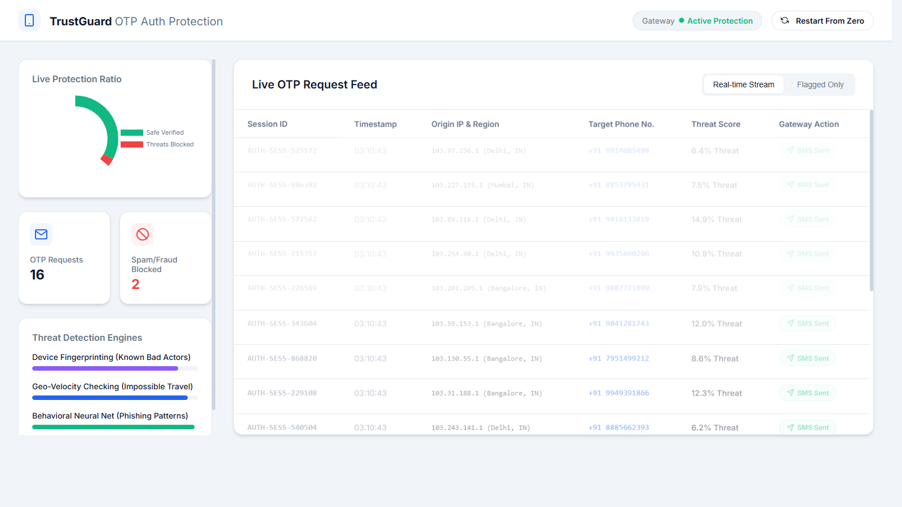

<div align="center">
  
# 🛡️ TrustGuard: OTP Fraud Authentication Dashboard

**A real-time, high-speed simulated machine learning dashboard designed to detect, track, and mitigate SMS/OTP authentication fraud across global telecommunication networks.**


<br>



</div>

---

## 📖 Table of Contents
- [Project Overview](#-project-overview)
- [Key Features](#-key-features)
- [Simulated ML Engines](#-simulated-ml-engines)
- [Technology Stack](#-technology-stack)
- [How to Run it Locally](#-how-to-run-it-locally)

---

## 🔎 Project Overview
**TrustGuard** is an interactive, completely bespoke application designed to simulate the fast-paced environment of a telecommunications Security Operations Center (SOC). It visualizes heavy incoming traffic of OTP (One Time Password) attempts and immediately flags anomalies based on simulated machine-learning confidence scores—acting as the ultimate demonstration for contemporary cyber-security pipelines.

## 🌟 Key Features

- **Blazing Fast Request Simulation**: A continuously streaming Node.js backend acting as a mock API, generating randomized chunks of OTP authentication requests mimicking peak server loads.
- **Active Traffic Visuals**: Utilizing **Chart.js** to continuously paint the live ratio of Safe Requests vs Blocked Threats without stuttering or DOM lag.
- **Interactive Gateway Protection**: A beautifully engineered toggle system right inside the metrics layout that allows the user to magically pause or resume the security stream on demand without reloading the page.
- **Instant System Reboot**: Complete numerical layout and chart reset via the "Restart From Zero" functionality.

## 🧠 Simulated ML Engines

To provide a highly realistic fraud-monitoring environment, TrustGuard mathematically mirrors three critical security layers during its data evaluation:
1. 🖥️ **Device Fingerprinting Risk**: Evaluating headers and synthetic browser-fingerprints to match known bad actors or previously blacklisted devices.
2. 🌍 **Geo-Velocity Checking**: "Impossible Travel" algorithms mapped against origin IPs to assure a user isn't physically requesting an OTP from India and then the USA 5 minutes later.
3. 🕸️ **Behavioral Neural Network Ensembler**: Deep phishing pattern detection mapped across thousands of generated synthetic data points.

### 💡 Architecture Note: Training Data vs Synthetic Pipeline
In modern cybersecurity, malicious actors constantly evolve their phishing tools, making static `.csv` files (like older Kaggle datasets) rapidly obsolete for behavior mapping. 

Rather than relying on static supervised learning, this project demonstrates a modern **Real-Time Data Pipeline and Visualization SOC**. The backend (`server.js`) utilizes a completely custom **Synthetic Data Generation Engine** to actively generate live, randomized traffic mimicking real-world botnet loads. The system then demonstrates **Unsupervised Anomaly Detection**—dynamically flagging anomalies (like inhuman burst requests or impossible geography) exactly as an active pipeline would catch a live zero-day attack where there is no historical Kaggle data to train on.

## 🛠️ Technology Stack

- **Frontend Core**: Vanilla HTML / JS / CSS (Zero heavy UI frameworks to ensure maximum browser performance!).
- **Build Tool**: **Vite** for blazing-fast HMR and optimized production bundling.
- **Backend API**: Pure Node.js utilizing the native `http` module (`server.js`) to cleanly serve randomized JSON payloads via continuous polling internals.
- **Design & Icons**: A premium "glassmorphism" light-mode utilizing sleek typography alongside the minimalist **Feather Icons** package.

---

## 🚀 How to Run It Locally

No massive installations or complex `npm` packages are required. Follow these quick steps to launch both the API engine and the dashboard UI in seconds.

### 1. Launch the Secure Backend Engine
Open your terminal in the project directory, and initialize the data server:
```bash
node server.js
```
> *The simulated REST API goes live immediately on `http://localhost:3001`.*

### 2. Boot Up the Dashboard
Open a second terminal window and use Vite to launch the interface:
```bash
npm run dev
```
*(If PowerShell blocks npm globally on Windows, open standard CMD and run `cmd /c npm run dev`)*

Once both commands are active, simply navigate to the Localhost link provided by Vite (usually `http://localhost:5173`) to watch the traffic stream in live!

---

<p align="center">
  Built for the <strong><a href="https://github.com/maviyamustahsin/otp-fraud-detection">otp-fraud-detection</a></strong> repository by <strong><a href="https://github.com/maviyamustahsin">@maviyamustahsin</a></strong>.
</p>

<div align="center">
  <a href="#-trustguard-otp-fraud-authentication-dashboard">🔼 Back to Top</a>
</div>
